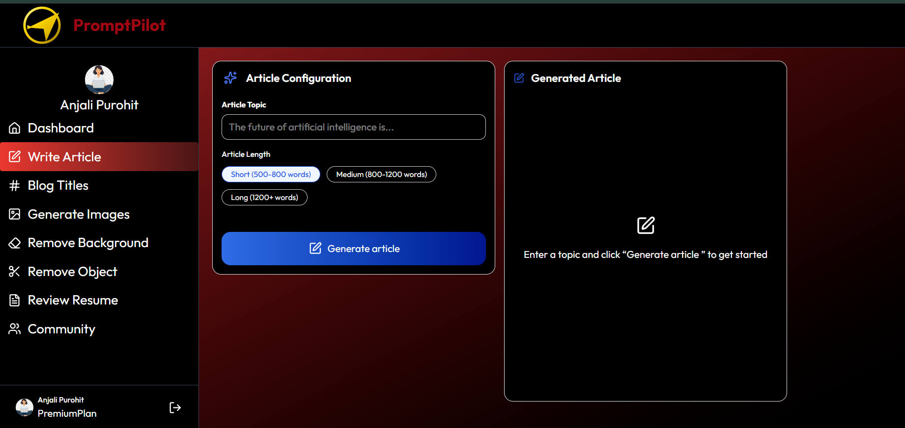
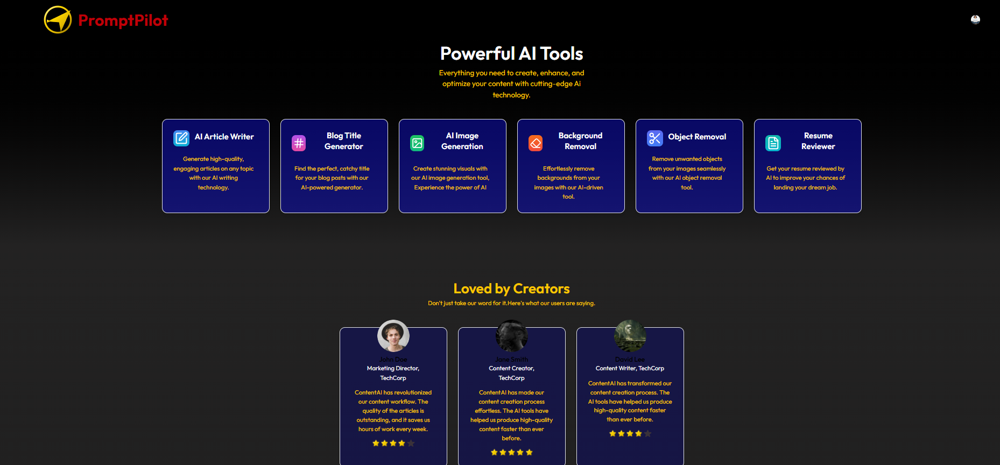
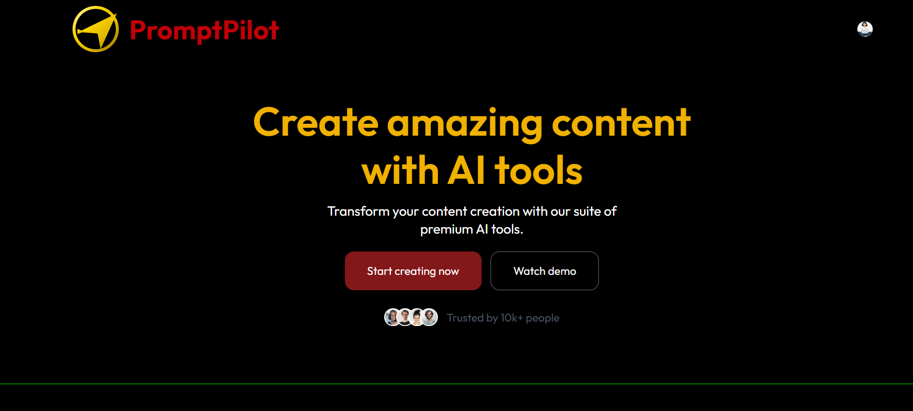

# 🚀 PromptPilot — AI SaaS Content Creation Platform

PromptPilot is a **full-stack AI-powered SaaS platform** designed to streamline modern content creation workflows.
It provides a unified dashboard where users can:

* ✍️ write AI articles
* 🧠 generate blog titles
* 🎨 create AI images
* 🪄 edit photos with AI
* 📄 review resumes using LLM feedback
* 🌐 share creations in a public community

—all inside **one seamless interface**.

---

## 🌐 Live Demo

🔗 **Live App:**
https://ai-saas-application-topaz.vercel.app/

---

## 📸 Screenshots





---

## 🌟 Core Features

### ✍️ AI Writing Tools

#### 📝 AI Article Writer

Generate high-quality formatted articles (Short / Medium / Long) powered by **Google Gemini Flash models**.

#### 🧠 Blog Title Generator

Create SEO-optimized blog titles instantly based on keywords or topics.

---

### 🎨 Creative Image Studio

#### 🖼️ AI Image Generator

Convert text prompts into images (Realistic, Anime, 3D styles) using **ClipDrop API**.

#### 🧹 Background Removal

Remove backgrounds instantly using **Cloudinary AI transformations**.

#### 🪄 Object Removal

Delete unwanted objects from images using generative AI editing.

---

### 💼 Career Tools

#### 📄 AI Resume Reviewer ⭐

Upload a **PDF resume** and receive ATS-style professional feedback:

* Overall Resume Score
* Strengths & Weaknesses
* Missing Keywords
* Formatting Suggestions
* ATS Optimization Tips
* Final Improvements

**Tech Used**

* PDF text extraction (`pdf-parse`)
* LLM Analysis via **Groq — Llama 3.3 70B**

---

### 👥 Community & Social

#### 🌐 Discovery Feed

Publish creations publicly and explore community posts.

#### ❤️ Social Interaction

Like and engage with other users’ creations.

#### 📂 Creation History

Access all generated content from your personal dashboard.

---

## 🔐 Authentication & Monetization

### 🔒 Secure Authentication

Powered by **Clerk Authentication**

Supports:

* OAuth Login
* Email/Password Login
* User Profiles
* Protected Routes

---

### 💳 Freemium SaaS Model

* Free usage limits
* Premium feature access
* Usage tracking system
* Subscription-ready architecture

---

## 🛠️ Tech Stack

### 🚀 Frontend

* React.js (Vite)
* Tailwind CSS
* React Router DOM
* Axios
* Lucide React Icons
* Clerk React SDK

---

### ⚙️ Backend

* Node.js
* Express.js
* PostgreSQL (Neon DB)
* Multer (File Upload Handling)
* Cloudinary Storage
* REST API Architecture

---

### 🧠 AI & APIs

| Category              | Technology          |
| --------------------- | ------------------- |
| LLM (Text Generation) | Google Gemini Flash |
| Resume Analysis       | Groq Llama-3.3-70B  |
| Image Generation      | ClipDrop API        |
| Image Editing         | Cloudinary AI       |
| Document Parsing      | pdf-parse           |

---

## 📂 Project Structure

```
PromptPilot/
│
├── client/
│   ├── src/
│   │   ├── assets/
│   │   ├── components/
│   │   ├── pages/
│   │   ├── App.jsx
│   │   └── main.jsx
│
├── server/
│   ├── controllers/
│   ├── routes/
│   ├── middlewares/
│   ├── configs/
│   └── server.js
```

---

## 🚀 Getting Started

### ✅ Prerequisites

* Node.js (v18+)
* PostgreSQL Database (Neon recommended)
* Clerk Account
* Cloudinary Account
* Groq API Key
* Gemini API Key
* ClipDrop API Key

---

## ⚙️ Environment Variables

### Client (`/client/.env`)

```
VITE_CLERK_PUBLISHABLE_KEY=your_clerk_key
VITE_BACKEND_URL=http://localhost:5000
```

---

### Server (`/server/.env`)

```
DATABASE_URL=your_postgres_url

CLERK_SECRET_KEY=your_clerk_secret

CLOUDINARY_CLOUD_NAME=
CLOUDINARY_API_KEY=
CLOUDINARY_API_SECRET=

GEMINI_API_KEY=
GROQ_API_KEY=
CLIPDROP_API_KEY=
```

---

## 📦 Installation

### 1️⃣ Clone Repository

```
git clone https://github.com/anjali-purohit16/AI_SAAS_APPLICATION.git
cd PromptPilot
```

---

### 2️⃣ Install Dependencies

```
cd client && npm install
cd ../server && npm install
```

---

### 3️⃣ Run Application

**Frontend**

```
npm run dev
```

**Backend**

```
node server.js
```

---

## 🧠 Resume Reviewer Workflow

1. User uploads PDF resume
2. Backend extracts text using `pdf-parse`
3. Resume analyzed by Groq Llama 3.3 model
4. AI generates ATS-style feedback
5. Result stored in database
6. User accesses review anytime

---

## 🤝 Contributing

Pull requests are welcome.
For major changes, please open an issue first.

---

## 📄 License

MIT License

---

## 👩‍💻 About the Developer

Hi, I'm **Anjali Purohit** — a passionate **Full-Stack Developer** focused on:

* AI SaaS Applications
* MERN Stack Development
* System Design & DSA
* Real-world AI integrations

🔗 LinkedIn:
https://www.linkedin.com/in/purohitanjali098/

📧 Email:
[purohitanjali098@gmail.com](mailto:purohitanjali098@gmail.com)

---

⭐ If you like this project, consider giving it a star!
