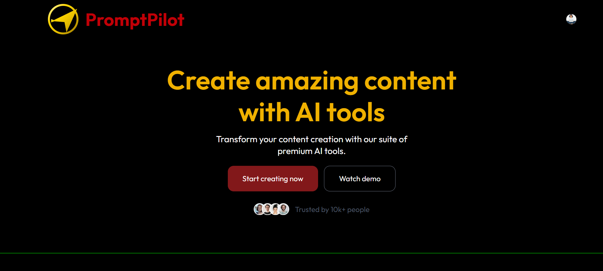
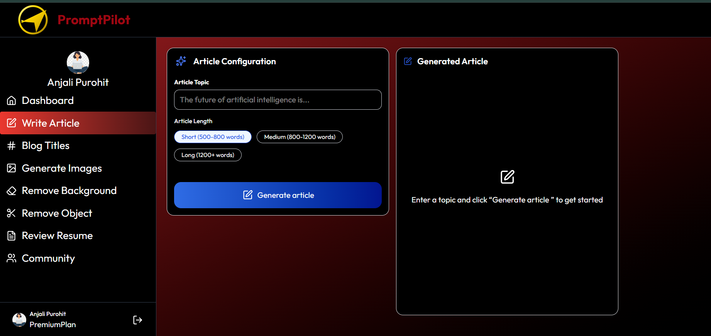
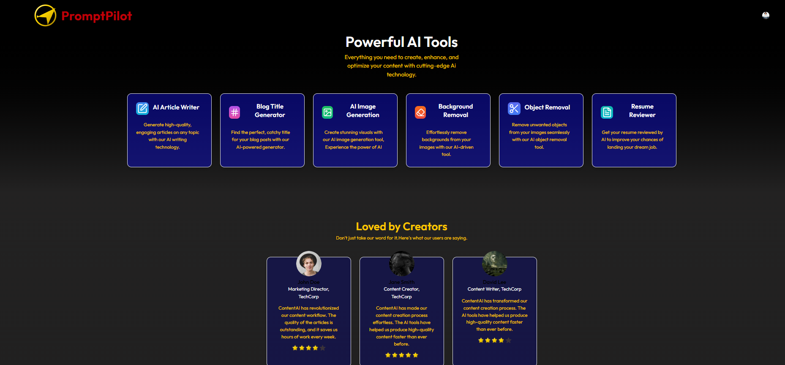

🚀 PromptPilot
Create Smarter, Faster, with AI ⚡

PromptPilot is a full-stack AI-powered SaaS platform that streamlines content creation.
It provides a unified dashboard where users can write articles, generate blog titles, create AI images, edit photos, review resumes, and share content within a public community — all in one seamless interface.

🌐 Live Demo

🔗 Live App: https://ai-saas-application-topaz.vercel.app/

📸 Screenshots

🌟 Core Features
📝 AI Content Studio
✍️ AI Article Writer

Generate high-quality, formatted blog articles (Short, Medium, Long) using Google Gemini 2.0 Flash.

🧠 Blog Title Generator

Create catchy, SEO-optimized titles based on keywords and categories.

🎨 Creative Image Tools
🖼️ AI Image Generator

Turn text prompts into stunning visuals (Realistic, Anime, 3D styles) using the ClipDrop API.

🧹 Background Removal

Instantly remove image backgrounds using Cloudinary AI transformations.

🪄 Object Removal

Remove unwanted objects using generative AI-based editing.

💼 Career Tools
📄 Resume Reviewer

Upload your resume (PDF) and receive AI-powered feedback and improvement suggestions using Gemini.

👥 Community & Social
🌐 Discovery Feed

Publish your creations to a public feed.

❤️ Social Interactions

Like and explore content from other users.

📂 Content History

Track all AI-generated articles, images, and resume reviews from your dashboard.

🔐 Authentication & Monetization
🔒 Secure Authentication

Powered by Clerk
Supports OAuth, email/password, profile management.

💳 Free/Premium Billing Model

Integrated billing with Clerk Billing.
Includes:
Smart credit system
Free usage limits
Premium access for advanced features

🛠️ Tech Stack

🚀 Frontend
React.js (Vite)
Tailwind CSS
React Router DOM
Axios
Lucide React
Clerk SDK

⚙️ Backend
Node.js
Express.js
PostgreSQL (Neon DB)
Multer (File Uploads)
PDF-Parse (Resume analysis)

🧠 AI & APIs

LLM: Google Gemini 2.0 Flash

Image Generation: ClipDrop

Computer Vision: Cloudinary

📂 Project Structure
├── client/
│   ├── src/
│   │   ├── assets/
│   │   ├── components/
│   │   ├── pages/
│   │   ├── App.jsx
│   │   └── main.jsx
│
├── server/
│   ├── controllers/
│   ├── routes/
│   ├── middlewares/
│   └── server.js

🚀 Getting Started

✅ Prerequisites

Node.js (v18+)

PostgreSQL Database (Neon recommended)

Clerk Account

Cloudinary Account

Gemini API Key

ClipDrop API Key

⚙️ Environment Variables
Client (.env)
VITE_CLERK_PUBLISHABLE_KEY=your_clerk_key
VITE_BACKEND_URL=http://localhost:5000

Server (.env)
DATABASE_URL=your_postgres_url
CLERK_SECRET_KEY=your_clerk_secret
CLOUDINARY_CLOUD_NAME=your_cloud_name
CLOUDINARY_API_KEY=your_key
CLOUDINARY_API_SECRET=your_secret
GEMINI_API_KEY=your_gemini_api
CLIPDROP_API_KEY=your_clipdrop_api
STRIPE_SECRET_KEY=your_stripe_secret

📦 Installation
1️⃣ Clone Repository
git clone https://github.com/anjali-purohit16/promptpilot.git
cd promptpilot

2️⃣ Install Dependencies
npm install

Or if separated:

cd client && npm install
cd ../server && npm install

3️⃣ Run Application

Frontend
npm run dev

Backend
node server.js

🤝 Contributing

Pull requests are welcome.
For major changes, please open an issue first to discuss improvements.

📄 License

This project is licensed under the MIT License.

👨🏻‍💻 About the Developer

Hi, I’m Anjali Purohit
A passionate Full-Stack Developer focused on MERN Stack, DSA, and building scalable AI-powered applications.

🔗 LinkedIn: https://www.linkedin.com/in/purohitanjali098/

📧 Email: purohitanjali098@gmail.com
